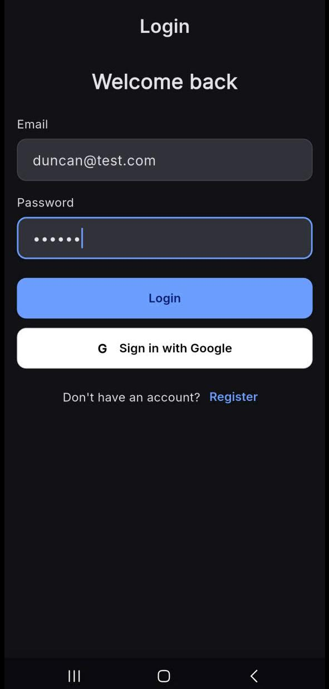
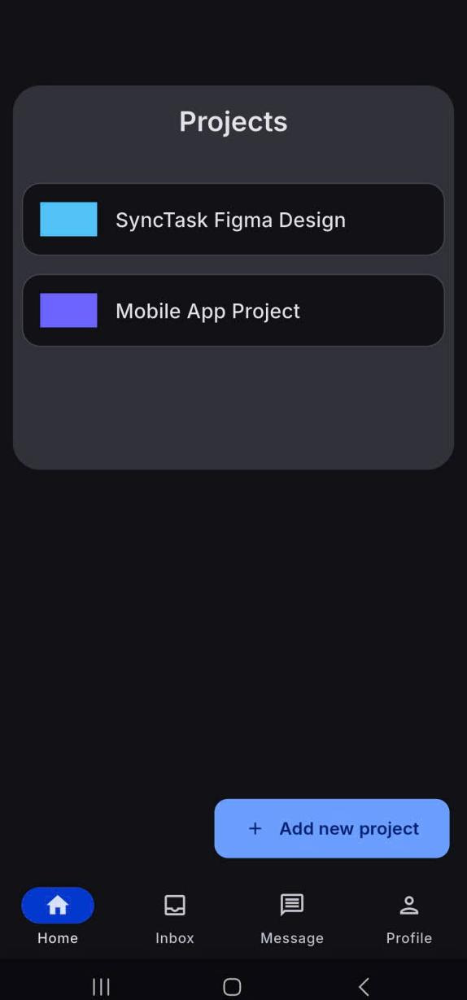
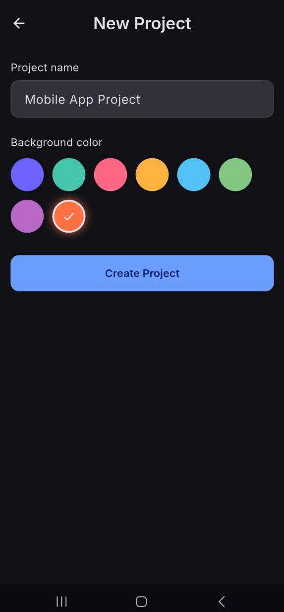
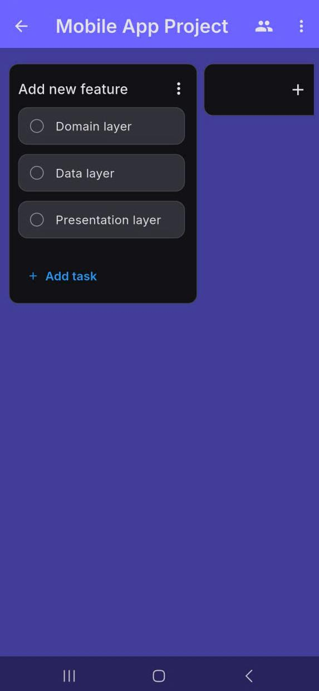
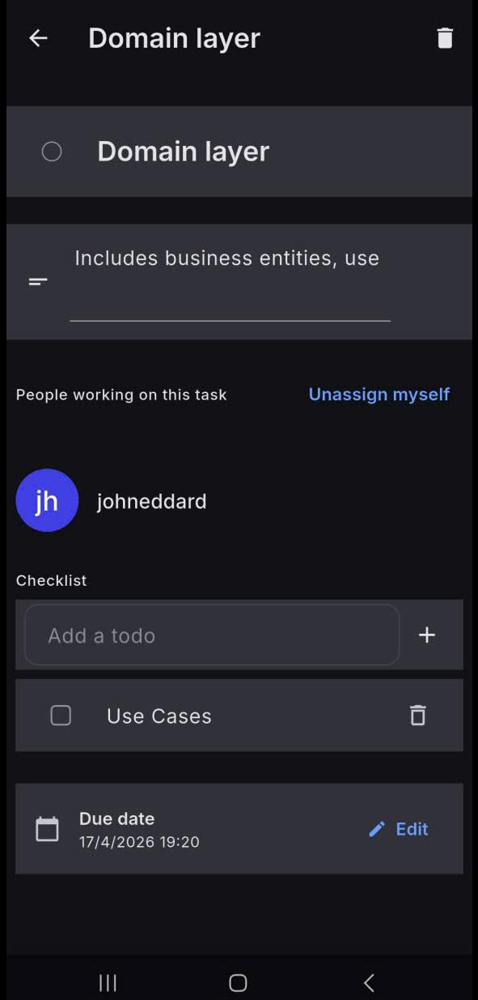
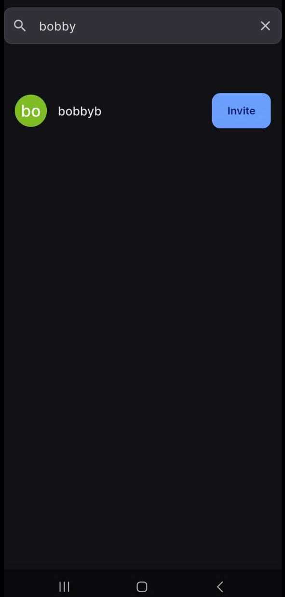
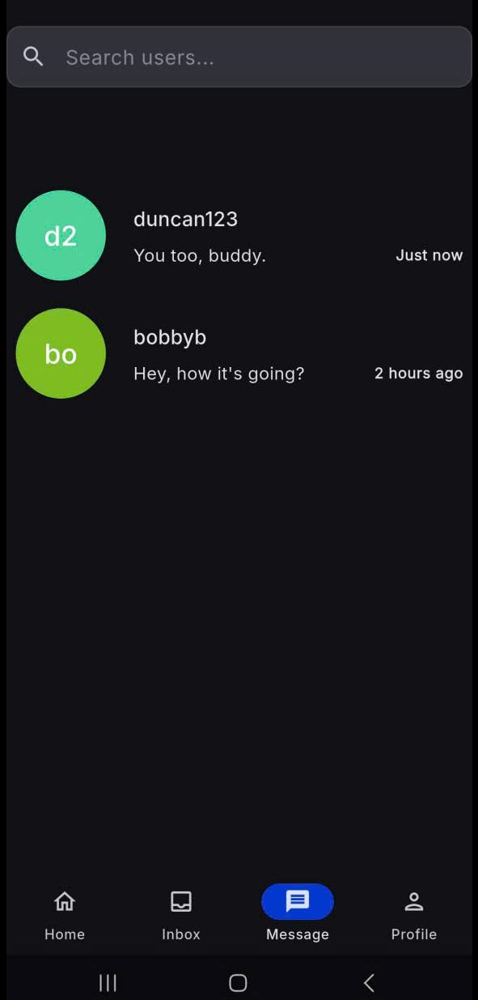
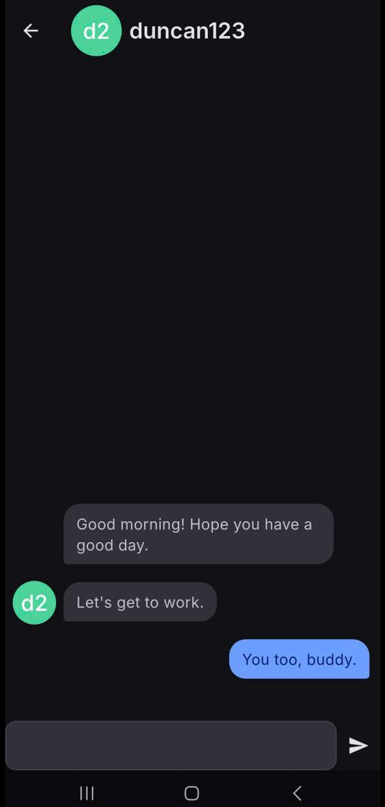

# SyncTask

A realtime project collaboration Flutter app with instant messaging and reactive workspace features, built with Clean Architecture principles for a strict separation of concerns and high modularity of the codebase.

---

## 📁 Project Structure

The codebase follows **Clean Architecture**, where every feature is split into three independent layers:

| Layer | Responsibility |
|---|---|
| 🟣 **Domain** | Business logic — entities, repository contracts, use cases |
| 🔵 **Data** | Data access — models, data sources, repository implementations |
| 🟢 **Presentation** | UI — BLoC/Cubit state management, screens, widgets |

```
lib/
├── config/                          
│   ├── dependencies.dart            
│   ├── hive_adapters.dart           
│   └── routing/
│       ├── router.dart
│       └── routes.dart
│
├── core/                            
│   ├── theme/
│   │   ├── app_theme.dart
│   │   ├── color_scheme.dart
│   │   └── text_theme.dart
│   └── ui/
│       ├── bottom_nav_bar_screen.dart
│       └── user_circle_avatar.dart
│
├── features/
│   │
│   ├── auth/                        # Authentication
│   │
│   ├── inbox/                       # Inbox (assigned tasks)
│   │   
│   ├── messaging/                   # Real-time chat & conversations
│   │   ├── 🟣 domain/
│   │   │   ├── entities/
│   │   │   │   ├── conversation.dart
│   │   │   │   ├── conversation_preview.dart
│   │   │   │   └── message.dart
│   │   │   ├── repositories/
│   │   │   │   ├── conversation_repository.dart
│   │   │   │   └── message_repository.dart
│   │   │   └── usecases/
│   │   │       ├── conversation/
│   │   │       │   ├── add_conversation_usecase.dart
│   │   │       │   ├── check_existing_conversation_usecase.dart
│   │   │       │   ├── delete_conversation_usecase.dart
│   │   │       │   ├── get_conversation_list_usecase.dart
│   │   │       │   └── get_conversation_previews_usecase.dart
│   │   │       └── message/
│   │   │           ├── delete_message_usecase.dart
│   │   │           ├── get_conversation_messages_usecase.dart
│   │   │           └── send_message_usecase.dart
│   │   ├── 🔵 data/
│   │   │   ├── data_sources/
│   │   │   │   ├── conversation_remote_data_source.dart
│   │   │   │   └── message_remote_data_source.dart
│   │   │   ├── models/
│   │   │   │   ├── conversation_model.dart
│   │   │   │   ├── message_model.dart
│   │   │   │   └── *.g.dart               # Generated Hive adapters
│   │   │   └── repositories/
│   │   │       ├── conversation_repository_impl.dart
│   │   │       └── message_repository_impl.dart
│   │   └── 🟢 presentation/
│   │       ├── bloc/
│   │       │   ├── chat_event.dart
│   │       │   ├── chat_state.dart
│   │       │   ├── conversation_bloc.dart
│   │       │   └── message_screen_cubit.dart
│   │       ├── ui_models/
│   │       │   └── conversation_display.dart
│   │       └── widgets/
│   │           ├── chat_bubble.dart
│   │           ├── conversation_screen.dart
│   │           └── message_screen.dart
│   │
│   ├── profile/                     # User profile
│   │
│   ├── project/                     # Projects, task lists & tasks
│   │   ├── 🟣 domain/
│   │   │   ├── entities/
│   │   │   │   ├── project.dart
│   │   │   │   ├── task.dart
│   │   │   │   └── task_list.dart
│   │   │   ├── repositories/
│   │   │   │   ├── project_repository.dart
│   │   │   │   ├── task_list_repository.dart
│   │   │   │   └── task_repository.dart
│   │   │   └── usecases/
│   │   │       ├── project/
│   │   │       │   ├── add_project_usecase.dart
│   │   │       │   ├── delete_project_usecase.dart
│   │   │       │   ├── get_project_by_uid_usecase.dart
│   │   │       │   ├── get_projects_usecase.dart
│   │   │       │   ├── invite_user_usercase.dart
│   │   │       │   └── leave_project_usecase.dart
│   │   │       ├── task/
│   │   │       │   ├── add_task_usecase.dart
│   │   │       │   ├── add_todo_usecase.dart
│   │   │       │   ├── assign_user_to_task_usecase.dart
│   │   │       │   ├── check_task_usecase.dart
│   │   │       │   ├── check_todo_usecase.dart
│   │   │       │   ├── delete_task_usecase.dart
│   │   │       │   ├── get_task_usecase.dart
│   │   │       │   └── remove_todo_usecase.dart
│   │   │       └── task_list/
│   │   │           ├── add_task_list_usecase.dart
│   │   │           ├── archive_task_list_usecase.dart
│   │   │           ├── delete_task_list_usecase.dart
│   │   │           └── get_task_lists_usecase.dart
│   │   ├── 🔵 data/
│   │   │   ├── data_sources/
│   │   │   │   ├── project_local_data_source.dart
│   │   │   │   ├── project_remote_data_source.dart
│   │   │   │   ├── task_list_remote_data_source.dart
│   │   │   │   └── task_remote_data_source.dart
│   │   │   ├── models/
│   │   │   │   ├── project_model.dart
│   │   │   │   ├── task_list_model.dart
│   │   │   │   ├── task_model.dart
│   │   │   │   └── *.g.dart               # Generated Hive adapters
│   │   │   └── repositories/
│   │   │       ├── project_repository_impl.dart
│   │   │       ├── task_list_repository_impl.dart
│   │   │       └── task_repository_impl.dart
│   │   └── 🟢 presentation/
│   │       ├── bloc/
│   │       │   ├── add_project_cubit.dart
│   │       │   ├── archive_screen_cubit.dart
│   │       │   ├── home_screen_cubit.dart
│   │       │   ├── project_collaborators_screen_cubit.dart
│   │       │   ├── project_screen_cubit.dart
│   │       │   └── task_cubit.dart
│   │       ├── ui_models/
│   │       │   └── task_ui_model.dart
│   │       └── widgets/
│   │           ├── add_project_screen.dart
│   │           ├── archive_screen.dart
│   │           ├── home_screen.dart
│   │           ├── project_collaborators_screen.dart
│   │           ├── project_screen.dart
│   │           └── task_screen.dart
│   │
│   └── user/                        # User search & profile data
│
├── utils/                           # Shared utilities & helpers
│   ├── app_date_formatter.dart
│   ├── app_exception.dart
│   ├── firebase_path.dart
│   ├── generate_default_avatar.dart
│   ├── logger.dart
│   ├── mapper_extension.dart
│   ├── result.dart
│   ├── ui_state.dart
│   └── validators.dart
│
├── firebase_options.dart
└── main.dart
```

---

## 📸 Screenshots

<table>
  <tr>
    <td align="center"><b>Login Screen</b></td>
    <td align="center"><b>Home Screen</b></td>
    <td align="center"><b>Adding Project</b></td>
    <td align="center"><b>Project Screen</b></td>
  </tr>
  <tr>
    <td></td>
    <td></td>
    <td></td>
    <td></td>
  </tr>
  <tr>
    <td align="center"><b>Task Screen</b></td>
    <td align="center"><b>Inviting Users</b></td>
    <td align="center"><b>Message Screen</b></td>
    <td align="center"><b>Conversation Screen</b></td>
  </tr>
  <tr>
    <td></td>
    <td></td>
    <td></td>
    <td></td>
  </tr>
</table>
